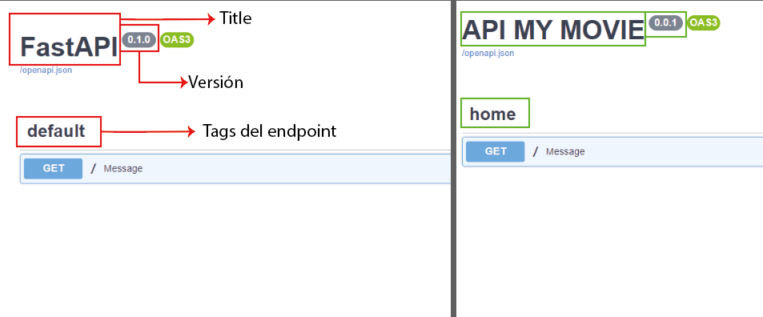

<div align="center">
  <h1>Curso de Introducción a FastAPI: </h1>
  <h2>Path Operations, Validaciones y Autenticación</h2>
</div>
<div align="center" style="margin-top:20px;"> 
  
</div>

<div style="margin-bottom:50px;"></div>

## Instalación de FastAPI y creación de tu primera aplicación
---

1. Creamos la carpeta del proyecto

```bash
mkdir nombre_carpeta
```

2. Dentro de la carpeta creamos el entorno virtual

```python
python -m venv nombre_entorno
```

3. Luego de creado activarlo
> Este comando sirve para windows
```python
nombre_entorno/Scripts/activate
```

> Para linux puede realizarse el siguiente comando:
```python
source nombre_entorno/bin/activate
```

4. Instalar modulos para el proyecto:

    - **fastapi**
    ```python
    pip install fastapi
    ```
    - **uvicorn**
    ```python
    pip install uvicorn
    ```
5. Para ejecutar el programa
nombre_del_archivo:nombre_de_instancia
```python
uvicorn main:app
```
> para recargar automaticamente los cambios 
```python
uvicorn main:app --reload
```
> para cambiar el puerto predeterminado
```python
uvicorn main:app --reload --port 5000
```
> para dejar disponible para todos los dispositivos en la misma red
```python
uvicorn main:app --reload --port 5000 --host 0.0.0.0
```

6. Crear primer archivo, en este caso llamado main.py

```python
from fastapi import FastAPI

app = FastAPI()

@app.get('/')
def message():
    return "Hello, world!"
```

<div style="margin-bottom:50px;"></div>

## Documentación automática con Swagger
---
FastAPI integra automáticamente una documentación autogenerada con Swagger.

La cual va a describir cada uno de los endpoints de nuestra apliacación, sabandose en los estandares de open API.

> para acceder agregarle a la url /docs

__http://127.0.0.1:8000/docs__


1. Cambiar titulo en la documentación

```python
from fastapi import FastAPI

app = FastAPI()

app.title = 'API MY MOVIE'
```

2. Cambiar la versión en la documentación

```python
from fastapi import FastAPI

app = FastAPI()

app.version = "0.0.1"
```

3. Cambiar nombre del tag de la url

```python
from fastapi import FastAPI

app = FastAPI()

@app.get('/', tags=['home'])
def message():
    return "Hello, world!"
```

>Ejemplo completo:
```python
from fastapi import FastAPI

app = FastAPI()

# Cambiar el titulo de la documentación
app.title = 'API MY MOVIE'

# Cambiar la versión de la documentación
app.version = "0.0.1"

@app.get('/', tags=['home'])
def message():
    return "Hello, world!"
```


<div style="margin-bottom:50px;"></div>

## Métodos HTTP en FastAPI
---
El protocolo HTTP es aquel que define un conjunto de métodos de petición que indican la acción que se desea realizar para un recurso determinado del servidor.

Los principales métodos soportados por HTTP y por ello usados por una API REST son:

1. **GET:** consultar información de un recurso.
1. **POST:** crear un recurso nuevo.
1. **PUT:** modificar un recurso existente.
1. **DELETE:** eliminar un recurso.

***

### GET

1. Devolver HTML
```python
from fastapi import FastAPI
from fastapi.responses import HTMLResponse

app = FastAPI()

# Cambiar el titulo de la documentación
app.title = 'API MY MOVIE'

# Cambiar la versión de la documentación
app.version = "0.0.1"

@app.get('/', tags=['home'])
def message():
    return HTMLResponse('<h1 style=color:red> hola mundo </h1>')
```

2. Devolver diccionario
```python
from fastapi import FastAPI

app = FastAPI()
app.title = 'API MY MOVIE'
app.version = "0.0.1"

#variable de peliculas
movies = [
    {
        'id': 1,
        'title': 'Avatar',
        'overview': "En un exuberante planeta llamado Pandora viven los Na'vi, seres que ...",
        'year': '2009',
        'rating': 7.8,
        'category': 'Acción'    
    }
]

@app.get('/movies', tags=['movies'])
def get_movies():
    return movies
```

### POST
añadir un nuevo elemento, es importante importar Body, para recibir todos los parametros en un solo envío.
>Ejemplo en código

```python
from fastapi import FastAPI, Body

app = FastAPI()
app.title = 'API MY MOVIE'
app.version = "0.0.1"

@app.post('/movies', tags=['movies'])
def create_movie(
        id:int = Body(), 
        title:str = Body(), 
        overview:str = Body(), 
        year:int = Body(), 
        rating:float = Body(),
        category:str = Body()
    ):
    movies.append({
        "id":id,
        "title":title,
        "overview":overview,
        "year":year,
        "rating":rating,
        "category":category
    })
    return movies
```

### PUT
Editar una pelicula, el ID ya no se recibe en el body sino que se considera un query parameter

```python
from fastapi import FastAPI, Body

app = FastAPI()
app.title = 'API MY MOVIE'
app.version = "0.0.1"

@app.put('/movies/{id}', tags=['movies'])
def update_movie(
        id:int, 
        title:str = Body(), 
        overview:str = Body(), 
        year:int = Body(), 
        rating:float = Body(),
        category:str = Body()
    ):
    for item in movies:
        if item["id"] == id:
            item["title"] = title
            item["overview"] = overview
            item["year"] = year
            item["rating"] = rating
            item["category"] = category
    return movies
```

### DELETE
Eliminar una pelicula

```python
from fastapi import FastAPI, Body

app = FastAPI()
app.title = 'API MY MOVIE'
app.version = "0.0.1"

@app.delete('/movies/{id}', tags=['movies'])
def delete_movie(id:int):
    for item in movies:
        if item["id"] == id:
            movies.remove(item)
    return movies
```

<div style="margin-bottom:50px;"></div>


## Parámetros de ruta
---

para indicarle a una ruta o endpoint que requiere parametros realizamos lo siguiente:

1. En la ruta añadimos la variable {id}, o como deseemos nombrarle

2. En la función recibimos el parametro y le indicamos su tipo de dato

3. Realizamos la función que necesitemos.

>Ejemplo

```python
from fastapi import FastAPI

app = FastAPI()
app.title = 'API MY MOVIE'
app.version = "0.0.1"

#variable de peliculas
movies = [
    {
        'id': 1,
        'title': 'Avatar',
        'overview': "En un exuberante planeta llamado Pandora viven los Na'vi, seres que ...",
        'year': '2009',
        'rating': 7.8,
        'category': 'Acción'    
    },
    {
        'id': 2,
        'title': 'Avatar',
        'overview': "En un exuberante planeta llamado Pandora viven los Na'vi, seres que ...",
        'year': '2009',
        'rating': 7.8,
        'category': 'Acción'    
    }
]

@app.get('/movies/{id}', tags=['movies'])
def get_movie(id: int):
    movie = list(filter(lambda x: x['id'] == id,movies))
    return movie if len(movie) > 0 else "No existe una pelicula"
```

## Parámetros Query
---

son una serie de clave y valor, que nos permiten extender más las búsquedas

> Se indica en la función pero no en el endpoint

> El endpoint debe terminar con una barra lateral al final para no sobreescribir rutas iguales

```python
from fastapi import FastAPI

app = FastAPI()
app.title = 'API MY MOVIE'
app.version = "0.0.1"

#variable de peliculas
movies = [
    {
        'id': 1,
        'title': 'Avatar',
        'overview': "En un exuberante planeta llamado Pandora viven los Na'vi, seres que ...",
        'year': '2009',
        'rating': 7.8,
        'category': 'Acción'    
    },
    {
        'id': 2,
        'title': 'Avatar',
        'overview': "En un exuberante planeta llamado Pandora viven los Na'vi, seres que ...",
        'year': '2009',
        'rating': 7.8,
        'category': 'Acción'    
    }
]

@app.get('/movies/', tags=['movies'])
def get_movies_by_category(category: str):
    movie = list(filter(lambda x: x['category'] == category,movies))
    return movie if len(movie) > 0 else "No existe una pelicula en dicha categoría"
```

## Creación de esquemas
---

Con ayuda de la libreria **pydantic**, crearemos esquemas de un objecto para no enviar todos los parametros en la función volviendose inmanejable según la cantidad del datos.

1. Importar la libreria
```python
from pydantic import BaseModel
```
2. Crear el esquema, se debe añadir una clase
```python
from pydantic import BaseModel

class Movie(BaseModel):
    id: int | None = None
    title: str
    overview: str
    year: int
    rating: float
    category: str
```

3. Para los campos opcionales se puede importar otra libreria llamada typing

```python
from pydantic import BaseModel
from typing import Optional

class Movie(BaseModel):
    id: Optional[int] = None
    title: str
    overview: str
    year: int
    rating: float
    category: str
```

4. Para utilizar el esquema, se modificará algunos métodos

```python
from pydantic import BaseModel
from typing import Optional

class Movie(BaseModel):
    id: Optional[int] = None
    title: str
    overview: str
    year: int
    rating: float
    category: str

movies = [
    {
        'id': 1,
        'title': 'Avatar',
        'overview': "En un exuberante planeta llamado Pandora viven los Na'vi, seres que ...",
        'year': '2009',
        'rating': 7.8,
        'category': 'Acción'    
    },
    {
        'id': 2,
        'title': 'Avatar',
        'overview': "En un exuberante planeta llamado Pandora viven los Na'vi, seres que ...",
        'year': '2009',
        'rating': 7.8,
        'category': 'Acción'    
    }
]


@app.post('/movies', tags=['movies'])
def create_movie(movie:Movie):
    movies.append(movie)
    return movies

@app.put('/movies/{id}', tags=['movies'])
def update_movie(id:int, movie: Movie):
    for item in movies:
        if item["id"] == id:
            item["title"] = movie.title
            item["overview"] = movie.overview
            item["year"] = movie.year
            item["rating"] = movie.rating
            item["category"] = movie.category
    return movies
```

## Validaciones de tipos de datos
---
fastAPI tiene añadidas algunas validaciones por defecto, pero para mejorarlas y añadir más, importaremos otro método de la libria pydantic

1. Importar Field

```python
from pydantic import BaseModel, Field
```

2. Modificar el esquema
```python
class Movie(BaseModel):
    id: Optional[int] = None
    title:str = Field(min_length=5,max_length=15)
    overview:str = Field(min_length=15,max_length=50)
    year:int = Field(gt=1900,le=2023)
    rating:float = Field(ge=1, le=10)
    category:str = Field(min_length=5,max_length=15)

    class Config:
        schema_extra = {
            "example": {
                "id": 9999,
                "title": "The Shawshank Redemption",
                "overview": "Two imprisoned",
                "year": 1994,
                "rating": 9.3,
                "genre": "Drama",
            }
        }
```

<div style="margin-bottom:50px;"></div>

## Validaciones de parámetros
---

Como validar los parametros de ruta y de query

1. **Validar parametros de ruta**

se debe importar una clase de fastapi llamada Path


```python
from fastapi import FastAPI, Path
```

Se utiliza en los parametros de la función de la siguiente manera:

```python
from fastapi import FastAPI, Path

app = FastAPI()

@app.get('/movies/{id}', tags=['movies'])
def get_movie(id: int = Path(ge=1, le=2000)):
    movie = list(filter(lambda x: x['id'] == id,movies))
    return movie if len(movie) > 0 else "No existe una pelicula"
```

2. **Validar parametros query**

se debe importar una clase de fastapi llamada Query


```python
from fastapi import FastAPI, Query
```

Se utiliza en los parametros de la función de la siguiente manera:

```python
from fastapi import FastAPI, Query

app = FastAPI()

@app.get('/movies/', tags=['movies'])
def get_movies_by_category(category: str = Query(min_length=5, max_length=15)):
    movie = list(filter(lambda x: x['category'] == category,movies))
    return movie if len(movie) > 0 else "No existe una pelicula"
```

<div style="margin-bottom:50px;"></div>

## Tipos de respuestas
---

1. **HTML**

```python
from fastapi import FastAPI
from fastapi.responses import HTMLResponse

app = FastAPI()

# Cambiar el titulo de la documentación
app.title = 'API MY MOVIE'

# Cambiar la versión de la documentación
app.version = "0.0.1"

@app.get('/', tags=['home'])
def message():
    return HTMLResponse('<h1 style=color:red> hola mundo </h1>')
```

2. **JSON**

```python
from fastapi import FastAPI
from fastapi.responses import JSONResponse

app = FastAPI()
app.title = 'API MY MOVIE'
app.version = "0.0.1"

@app.get('/movies', tags=['movies'])
def get_movies():
    return JSONResponse(content=movies)

@app.get('/movies/{id}', tags=['movies'])
def get_movie(id: int = Path(ge=1, le=2000)):
    movie = list(filter(lambda x: x['id'] == id,movies))
    return JSONResponse(content=movie) if len(movie) > 0 else JSONResponse(content=[])

@app.get('/movies/', tags=['movies'])
def get_movies_by_category(category: str = Query(min_length=5, max_length=15)):
    movie = list(filter(lambda x: x['category'] == category,movies))
    return JSONResponse(content=movie) if len(movie) > 0 else JSONResponse(content=[])

@app.post('/movies', tags=['movies'])
def create_movie(movie:Movie):
    movies.append(movie)
    return JSONResponse(content={"message":"Se ha registrado la película"})

@app.put('/movies/{id}', tags=['movies'])
def update_movie(id:int, movie: Movie):
    for item in movies:
        if item["id"] == id:
            item["title"] = movie.title
            item["overview"] = movie.overview
            item["year"] = movie.year
            item["rating"] = movie.rating
            item["category"] = movie.category
    return JSONResponse(content={"message":"Se ha modificado la película"})
        
@app.delete('/movies/{id}', tags=['movies'])
def delete_movie(id:int):
    for item in movies:
        if item["id"] == id:
            movies.remove(item)
    return JSONResponse(content={"message":"Se ha eliminado la película"})

```

3. Podemos indicar el tipo de respuesta 

importamos de la libreria typing

```python
from typing import List
```

En la ruta agregamos otro parametro llamado response_model al igual que despues de los parentesis de la función

```python
from fastapi import FastAPI
from typing import List
from fastapi.responses import JSONResponse

app = FastAPI()
app.title = 'API MY MOVIE'
app.version = "0.0.1"


@app.get('/movies', tags=['movies'], response_model=List[Movie])
def get_movies() -> List[Movie]:
    return JSONResponse(content=movies)
```
> En la documentación pueden verse en la parte de response como un schema

<div style="margin-bottom:50px;"></div>

## Códigos de estado
---

Estos códigos nos van a indicar si dicha petición se ha ejecutado correctamente o ha ocurrido un error

1. **Informational responses** (100 - 199)
2. **Successful responses** (200 - 299)
3. **Redirection responses** (300 - 399)
4. **Client error responses** (400 - 499)
5. **Server error responses** (500 - 599)

Para agregar un código de estado, se debe agregar otro parametro al endpoint o ruta llamado status_code

```python
from fastapi import FastAPI
from typing import List
from fastapi.responses import JSONResponse

app = FastAPI()
app.title = 'API MY MOVIE'
app.version = "0.0.1"


@app.get('/movies', tags=['movies'], response_model=List[Movie], status_code=200)
def get_movies() -> List[Movie]:
    return JSONResponse(content=movies)
```

También puede añadirse en la respuesta:

```python
from fastapi import FastAPI
from typing import List
from fastapi.responses import JSONResponse

app = FastAPI()
app.title = 'API MY MOVIE'
app.version = "0.0.1"


@app.get('/movies', tags=['movies'], response_model=List[Movie], status_code=200)
def get_movies() -> List[Movie]:
    return JSONResponse(status_code=200,content=movies)
```
<div style="margin-bottom:50px;"></div>

## Flujo de autenticación
---
1. **Ruta para iniciar sesión**
Lo que obtendremos como resultado al final de este módulo es la protección de determinadas rutas de nuestra aplicación para las cuales solo se podrá acceder mediante el inicio de sesión del usuario. Para esto crearemos una ruta que utilice el método POST donde se solicitarán los datos como email y contraseña.

2. **Creación y envío de token**
Luego de que el usuario ingrese sus datos de sesión correctos este obtendrá un token que le servirá para enviarlo al momento de hacer una petición a una ruta protegida.

3. **Validación de token**
Al momento de que nuestra API reciba la petición del usuario, comprobará que este le haya enviado el token y validará si es correcto y le pertenece. Finalmente se le dará acceso a la ruta que está solicitando.

> Empezaremos con la creación de una función que nos va a permitir generar tokens usando la librería ***pyjwt***.

<div style="margin-bottom:50px;"></div>

## Generando tokens con pyjwt
---

1. Se debe instalar la libreria pyjwt

```python
pip install pyjwt
```

2. Crear un archivo nuevo llamado jwt_manager.py

3. Importar el modulo instalado, en dicho archivo

```python
from jwt import encode
```

4. Añadir función para crear token
```python
from jwt import encode

def create_token(data: dict):
    token:str = encode(payload=data, key="my_secrete_key", algorithm="HS256")
    return token
```

5. En el archivo main.py importar esta función
```python
from jwt_manager import create_token
```

6. Se debe crear una clase que permita añadir la información del usuario

```python
class User(BaseModel):
    email:str
    password:str
```

7. Crear ruta que le permita al usuario loguearse

```python
@app.post('/login',tags=['auth'])
def login(user: User):
    return user
```

<div style="margin-bottom:50px;"></div>

## Validando tokens
---

1. Creamos la función para loguearse al usuario esta vez incorporando el token

```python
@app.post('/login',tags=['auth'])
def login(user: User):
    if user.email == 'admin@mail.com' and user.password == 'admin':
        token:str = create_token(user.dict())
        return JSONResponse(status_code=200,content=token)
```

2. Creamos otra función en el archivo jwt_manager.py para validar el token

```python
def validate_token(token: str) -> dict:
    data:dict = decode(token, key="my_secrete_key", algorithms=['HS256'])
    return data
```

<div style="margin-bottom:50px;"></div>

## Middlewares de autenticación
---
Como solicitarle al usuario el token en determinadas rutas

1. importar de fastapi.security una clase llamada HTTPBearer

```python
from fastapi.security import HTTPBearer
```

2. Crear una clase basada en la importanción, importar Request

```python
from fastapi import FastAPI, Request, HTTPException
from fastapi.security import HTTPBearer

from jwt_manager import create_token, validate_token

class JWTBearer(HTTPBearer):
    async def __call__(self, request: Request):
        auth = await super().__call__(request)
        data = validate_token(auth.credentials)
        if data['email'] != "admin@mail.com":
            raise HTTPException(status=403, detail="Credenciales incorrectas")

```

3. Utilizar la función en alguna de las rutas

```python
from fastapi import FastAPI, Request, HTTPException,Depends
from fastapi.security import HTTPBearer

@app.get('/movies', tags=['movies'], response_model=List[Movie],status_code=200, dependencies=[Depends(JWTBearer())])
def get_movies() -> List[Movie]:
    return JSONResponse(status_code=200,content=movies)


```
> En la documentación la ruta aparecerá con un candado, significando que se requiere un token o autenticación


<div align="center" style="margin-top:50px;">
  <h1>Curso de Intermedio a FastAPI: </h1>
  <h2>Base de Datos, Modularización y Deploy a Producción</h2>
</div>
<div align="center" style="margin-top:20px;margin-bottom:50px;"> 
  
</div>

<div style="margin-bottom:50px;"></div>

## Instalación y configuración de SQLAlchemy
---

1. Instalamos previsualizador en visual studio code de base de datos llamada SQLite Viewer


2. Instalar el modulo SQLAlchemy
```python
pip install sqlalchemy
```

3. Creamos una carpeta llamada config

4. Dentro de la carpeta un archivo __init__.py para que la detecte como un módulo

5. Creamos dentro de config un archivo llamado database.py

6. Configuramos el archivo
```python
import os
from sqlalchemy import create_engine
from sqlalchemy.orm.session import sessionmaker
from sqlalchemy.ext.declarative import declarative_base

# Se guardara el nombre de la base de datos
sqlite_file_name = "database.sqlite"

# Se leera el directorio actual del archivo database
base_dir = os.path.dirname(os.path.realpath(__file__))   

# sqlite:/// es la forma en la que se conecta a una base de datos, se usa el metodo join para unir las urls
database_url = f"sqlite:///{os.path.join(base_dir, sqlite_file_name)}" 

# representa el motor de la base de datos, con el comando “echo=True” para que al momento de realizar la base de datos, me muestre por consola lo que esta realizando, que seria el codigo
engine = create_engine(database_url, echo=True)  

# Se crea session para conectarse a la base de datos, se enlaza con el comando “bind” y se iguala a engine

Session = sessionmaker(bind=engine)

# Sirve para manipular todas las tablas de la base de datos
Base = declarative_base()                                     

```

7. 